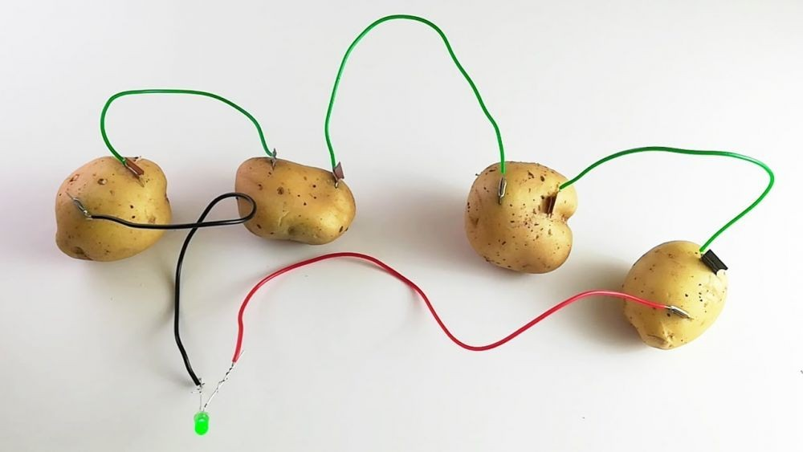

# Абсурдное резюме на должность Android Developer

Приветствую всех, кто решил прочитать мое резюме! Я - лучший андроид-разработчик во всей галактике. Я могу создавать приложения для любых жизненных ситуаций, будь то туалетная пауза или космический полет на ракете.

Я использую необычные методы разработки, такие как прогнозирование будущего и чтение мыслей, чтобы создавать приложения, которые пользователи даже не знали, что им нужны. Я не использую обычные языки программирования, я изобрел свой собственный язык - **"мистер-пропер"**.

Мои приложения - это не просто приложения, это настоящие произведения искусства. Я внедряю в них самые невероятные функции, такие как телепортация и трансформация в животных. Мои приложения также обладают уникальными способностями, такими как умение говорить с животными и транслировать мысли пользователей.

Я могу работать с любыми ресурсами, включая:
- картошку 
- батарейки 

>Я не боюсь рисковать и экспериментировать, потому что только так можно достичь настоящего успеха.

Если вы ищете человека, который может создавать необычные и удивительные приложения, то я - ***ваш человек***. Но если вы ищете простого андроид-разработчика, то лучше обратитесь к кому-то другому.